# FLAVOR KULLANIMI

Merhabalar öncelikle bu döküman Flutter ile favor kullanımını kolaylaştırmak adına oluşturulmuştur.

## Flutter Projesi Oluşturma

Öncelikle klasik olarak kullandığımız Flutter proje oluşturma komutunu kullanarak projemizi oluşturuyoruz.

    flutter create --org organization_name project_name

## Android Kurulumu

### Dosya yapısı

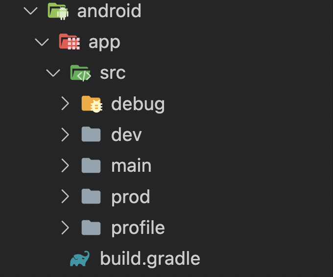

### Gradle dosyası yapılandırma

Aşağıdaki satırları `android/apps/build.gradle` dosyasının içerisine yapıştırıyoruz (tabi projenize göre özelleştirilmiş biçimde)

    flavorDimensions "app"
    productFlavors {
        prod {
            dimension "app"
            applicationId "com.seniorturkmen.flavor_demo"
            versionCode flutterVersionCode.toInteger()
            resValue "string", "app_name", "FlavorApp"
            versionName flutterVersionName
        }
 
        dev {
            dimension "app"
            applicationId "com.seniorturkmen.flavor_demo_test"
            versionCode flutterVersionCode.toInteger()
            resValue "string", "app_name", "FlavorAppTest"
            versionName flutterVersionName
        }
    }

### AndroidManifest.xml yapısı

`android/src/main/AndroidManifest.xml` dosyasının içerisinde yer alan `android:label` isimli alanın değerini görseldeki gibi değiştiriyoruz.

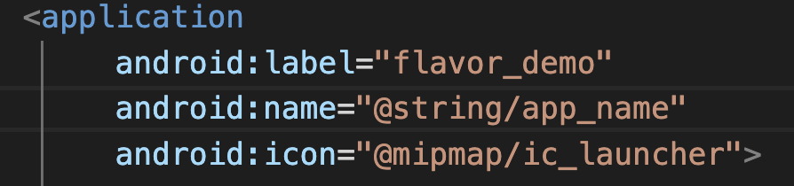

## iOS Kurulumu

iOS kurulumu yaparken xCode kullanmamız gerekiyor dolayısıyla xCode üzerinde projemizi açıyoruz.

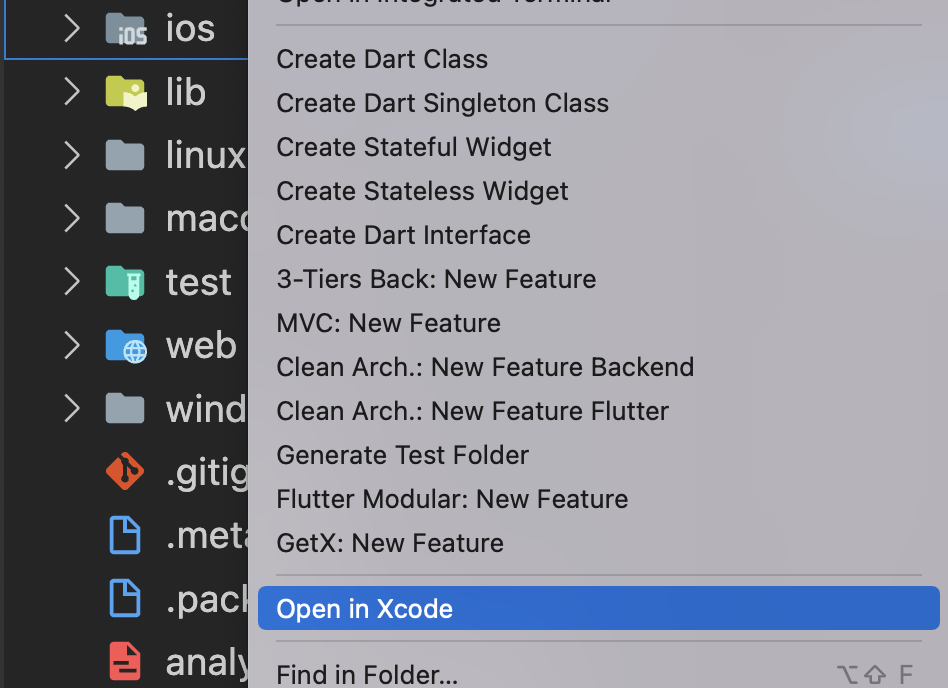

daha sonra şemalarımızı oluşturmaya başlıyoruz.

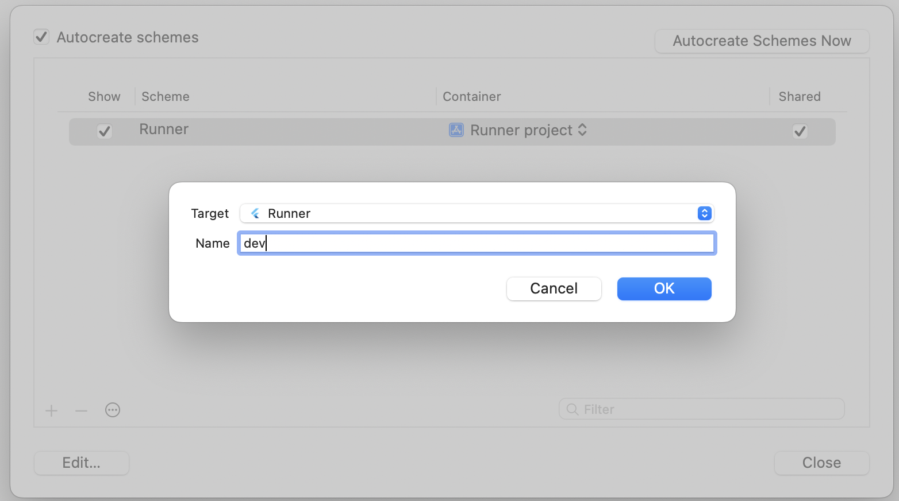

ben burada `prod`ve `dev`isimli 2 adet şema oluşturuyorum.

şemalarımızı oluşturduktan sonra configurasyonlarını ayarlama ile işlemlerimize devam ediyoruz.

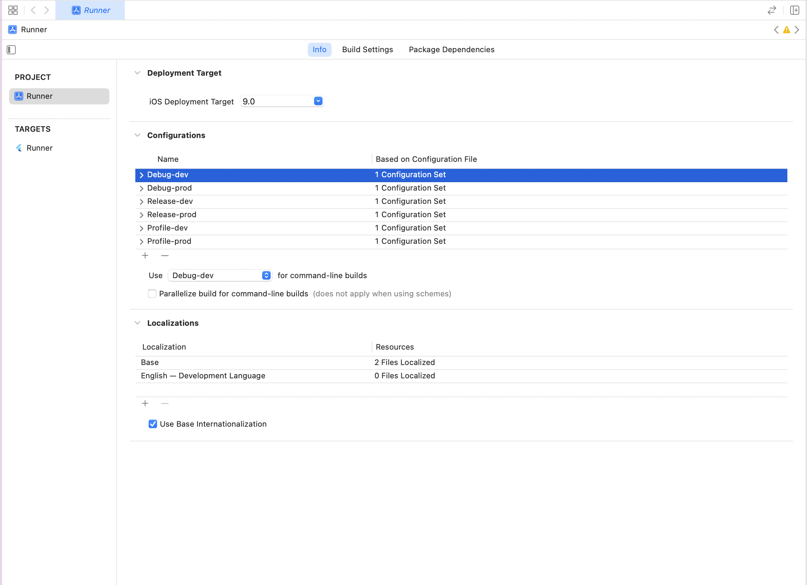

bu kısımda configurasyonlarımızı tamamladıktan sonra şemalarımız ile configurasyonlarımızı birbiri ile bağlıyoruz.

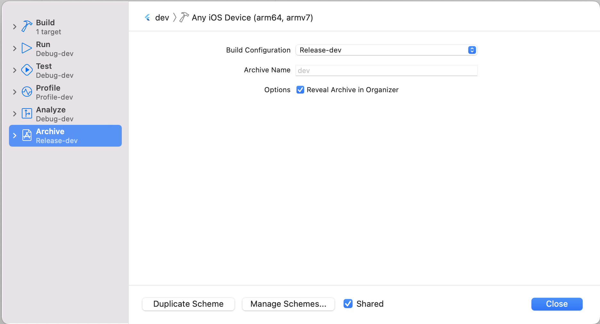

bu işlemi hem `prod` hem `dev` şemamız için gerçekleştiriyoruz.

bağlantı işlemlerimiz bittikten sonra her app için uniqe olan `bundle_id`değişkenini her şemamıza özel ayarlıyoruz.

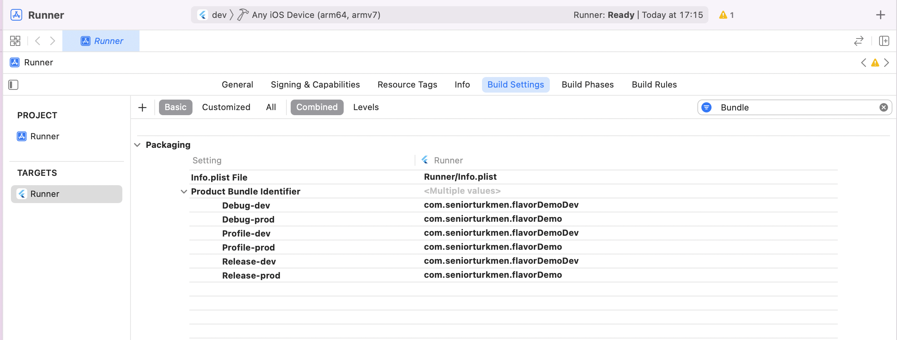

## Firebase entegrasyonu

iOS uygulamamızın firebase entegrasyonu için `GoogleService-Info.plist` dosyasına ihtiyaç duyulur bizler her flavor yapımıza farklı bir firebase projesi entegre etmek istersek birden fazla GoogleServices-Info.plist dosyası eklememiz gerekiyor. Bunun için xCode üzerinden devam ederek proje içerisinde `config`ismini verdiğim bir dosya oluşturuyorum ve içerisine flavor şemalarımla aynı ismi taşıyan klasörler oluşturuyorum.

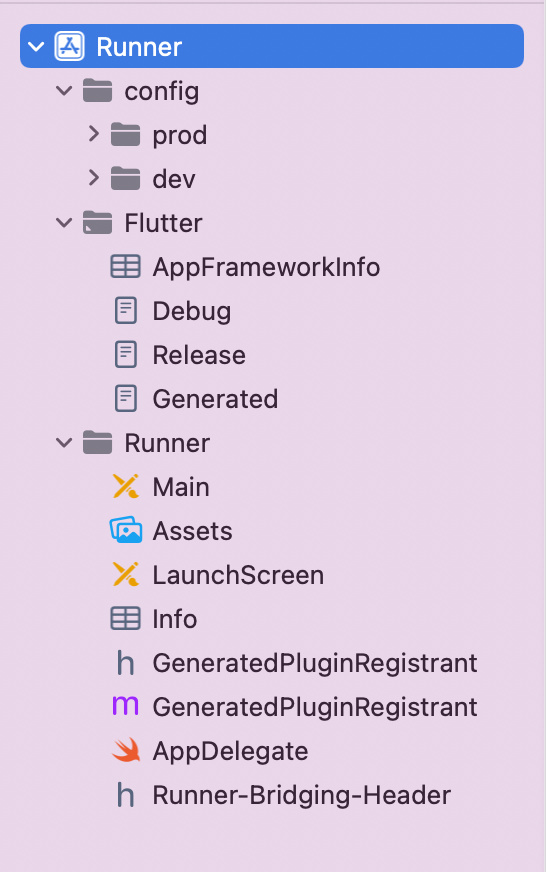

daha sonra bu klasörümü xCode içerisinde tanımlıyorum.

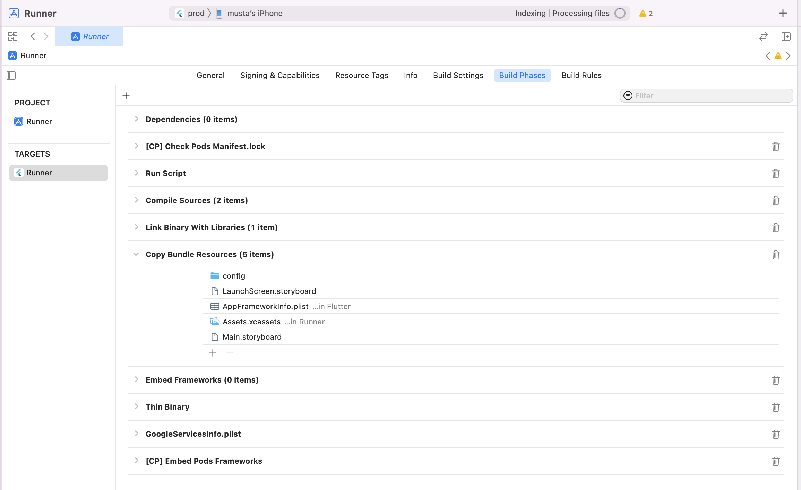

daha sonra proje çalıştığında ilgili dosyanın konumunu bulmasına yardımcı olan scriptimi de ekliyorum.

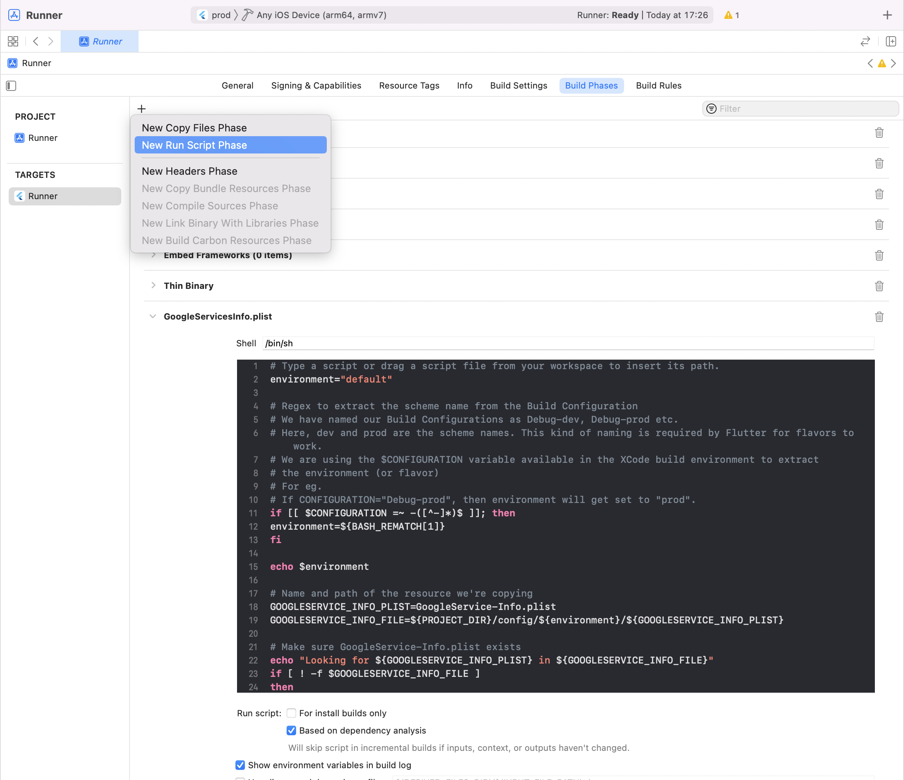

    setopt KSH_ARRAYS BASH_REMATCH
    environment="default"

    # Regex to extract the scheme name from the Build Configuration
    # We have named our Build Configurations as Debug-dev, Debug-prod etc.
    # Here, dev and prod are the scheme names. This kind of naming is required by Flutter for flavors to work.
    # We are using the $CONFIGURATION variable available in the XCode build environment to extract 
    # the environment (or flavor)
    # For eg.
    # If CONFIGURATION="Debug-prod", then environment will get set to "prod".
    if [[ $CONFIGURATION =~ -([^-]*)$ ]]; then
    environment=${BASH_REMATCH[1]}
    fi

    echo $environment

    # Name and path of the resource we're copying
    GOOGLESERVICE_INFO_PLIST=GoogleService-Info.plist
    GOOGLESERVICE_INFO_FILE=${PROJECT_DIR}/config/${environment}/${GOOGLESERVICE_INFO_PLIST}

    # Make sure GoogleService-Info.plist exists
    echo "Looking for ${GOOGLESERVICE_INFO_PLIST} in ${GOOGLESERVICE_INFO_FILE}"
    if [ ! -f $GOOGLESERVICE_INFO_FILE ]
    then
    echo "No GoogleService-Info.plist found. Please ensure it's in the proper directory."
    exit 1
    fi

    # Get a reference to the destination location for the GoogleService-Info.plist
    # This is the default location where Firebase init code expects to find GoogleServices-Info.plist file
    PLIST_DESTINATION=${BUILT_PRODUCTS_DIR}/${PRODUCT_NAME}.app
    echo "Will copy ${GOOGLESERVICE_INFO_PLIST} to final destination: ${PLIST_DESTINATION}"

    # Copy over the prod GoogleService-Info.plist for Release builds
    cp "${GOOGLESERVICE_INFO_FILE}" "${PLIST_DESTINATION}"

çalışan şemaya göre uygulama isminin değişmesi için son 1 adımımız kaldı.

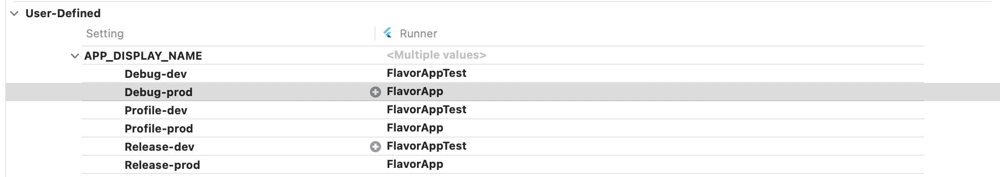

ve oluşturduğumuz ismi uygulama içerisinde kullanıyoruz.

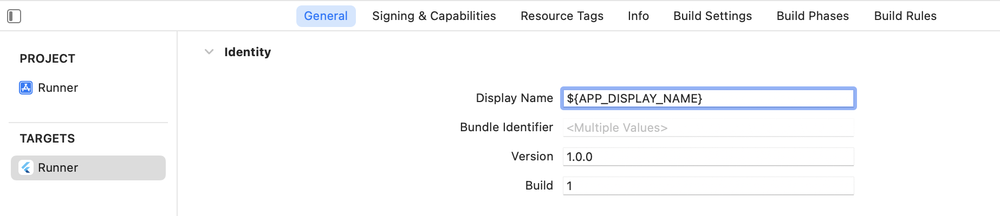

uygulamamız çalıştırılmaya hazır

## ilk çalıştırma

-**Dev ortamı için**

    flutter run --target=lib/main_dev.dart --flavor=dev

-**Prod ortamı için**

    flutter run --target=lib/main_prod.dart --flavor=prod

kodlarını girerek ilk çalıştırmayı sağlayabilirsiniz.

## VsCode Setup

Flutter uygulamamızı VsCode Run & Debug tool'u aracılığıyla çalıştırmak için son bir ayar yapmamız gerekiyor.

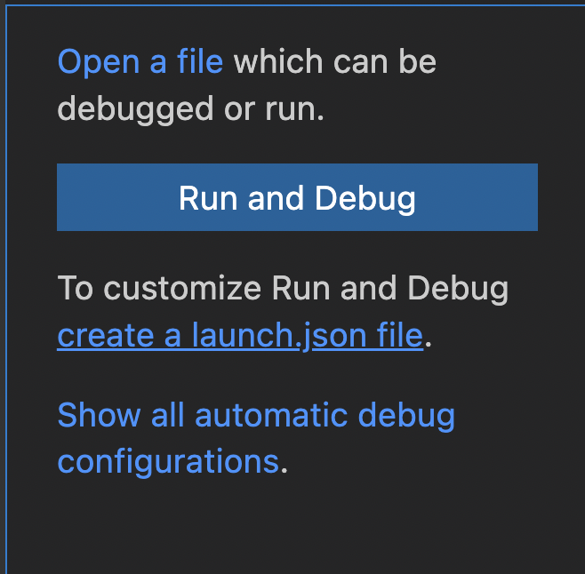

 buradan *create a launch.json file* alanına tıklıyoruz. Çıkan popup üzerinden Dart & Flutter opsiyonunu seçiyoruz. ve açılan sayfadaki kodları aşağıdaki kodlarla değiştiriyoruz.

    {
        "version": "0.2.0",
        "configurations": [
            {
                "name": "App Name (Test)",
                "type": "dart",
                "request": "launch",
                "program": "lib/main_dev.dart",
                "args": [
                    "--flavor",
                    "dev",
                ]
            },
            {
                "name": "App Name",
                "type": "dart",
                "request": "launch",
                "program": "lib/main_prod.dart",
                "args": [
                    "--flavor",
                    "prod",
                ]
            },
            
        ]
    }

Artık tool aracılığıyla daha kolay debug işlemi yapabilirsiniz.

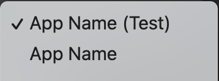
